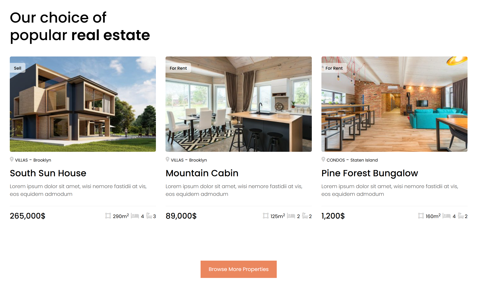

# 🏠 Housing Rental Front-End 🏠

    

## 📚 About

This repository is the **final project** for the Web Programming course. It is a front-end application for a **housing rental platform**, built using:

- **HTML**
- **CSS**
- **JavaScript**
- **Bootstrap**

## 🎯 Features

- 🌐 **Responsive Design**: Works across all devices.
- 🏨 **Property Listings**: Detailed property descriptions, images, and prices.
- 🎡 **Testimonials Carousel**: Highlight customer reviews.
- 📋 **Interactive Forms**: Inquiry forms for user engagement.
- 📊 **Sliders**: Showcase properties with image sliders.

## 🌟 Preview

### Homepage


### Property Listings


### Inquiry Form


## 📂 Project Structure

```
├── images/          # Contains all the image assets
├── style.css        # CSS styles for the project
├── New Home.html    # Main HTML file of the project
├── LICENSE          # Project's MIT license
├── screenCapture    # Preview images
```

## 🛠️ Technologies Used

-  **HTML5**: For building the structure of the pages.
-  **CSS3**: For styling and layout design.
-  **JavaScript (ES6)**: For interactive functionalities.
-  **Bootstrap 4.6.2**: For responsive and modern UI components.

## 📜 License

This project is licensed under the [MIT License](LICENSE).
